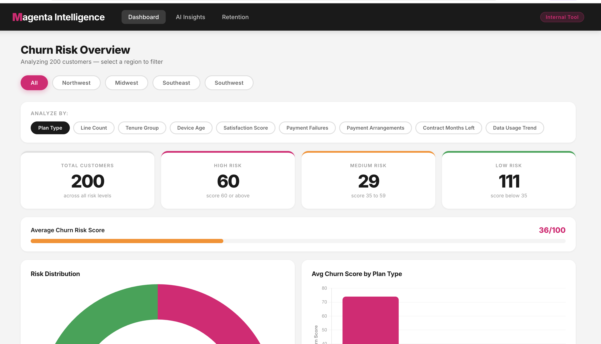
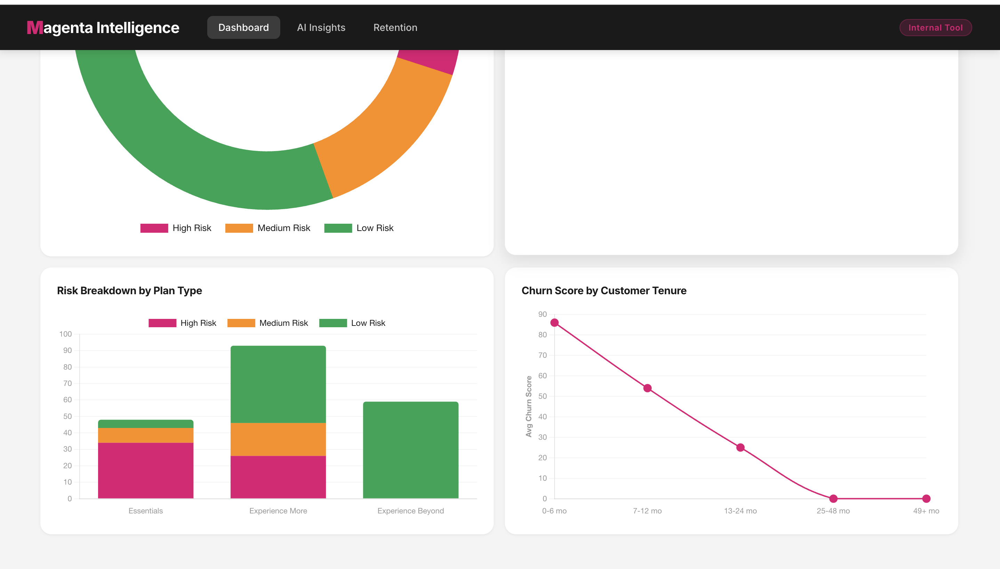
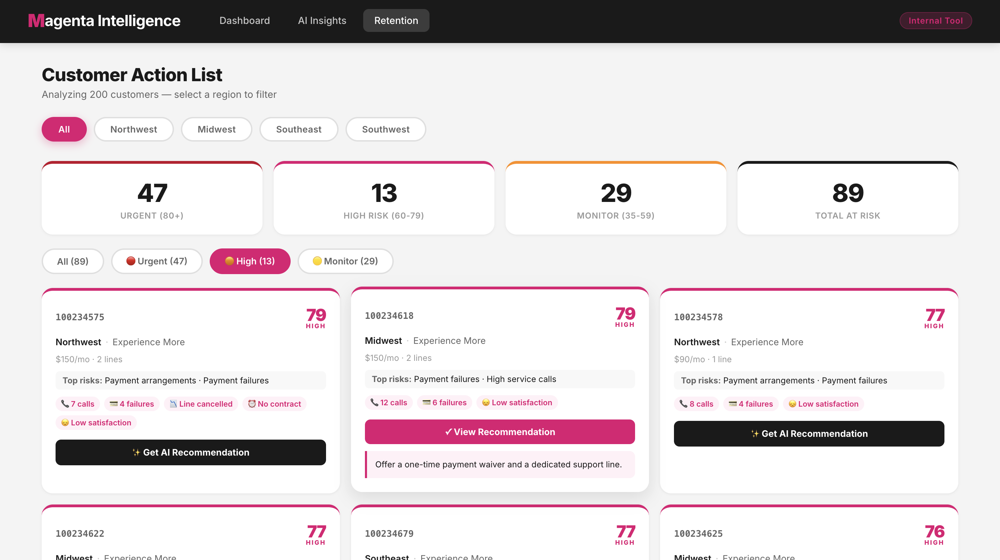
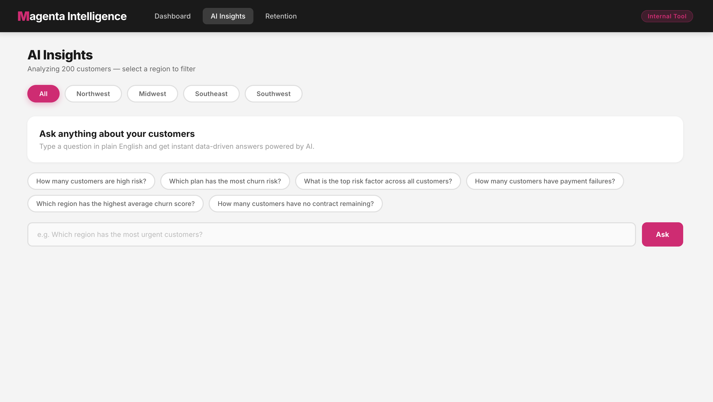

# Magenta Intelligence — Customer Churn Prediction Dashboard

An AI-powered full stack web application that analyzes T-Mobile customer data to predict churn risk, surface retention insights, and generate personalized AI recommendations for at-risk customers.

Built as a portfolio project to demonstrate full stack development, data science, and AI engineering skills.

---

## Live Demo

🔗 [Live Demo](https://tmobile-churn-dashboard.vercel.app)

---

## Screenshots

### Dashboard — Churn Risk Overview (Top)


### Dashboard — Charts & Visualizations


### Retention — Customer Action Cards


### AI Insights — Natural Language Queries


---

## What It Does

### Dashboard
- Analyzes 200 mock T-Mobile customer records across 4 regions
- Scores each customer 0–100 using a weighted churn risk algorithm built on 16 behavioral and financial variables
- Displays risk distribution, average churn score by plan type, and churn trends by customer tenure
- 10-variable toggle lets managers analyze churn through different lenses (payment failures, device age, satisfaction score, etc.)
- Region filter updates all charts in real time

### Retention
- Segments customers into Urgent (80+), High Risk (60–79), and Monitor (35–59) priority tiers
- Displays customer cards with churn score, top 2 risk factors, and key behavioral signals
- AI-powered retention recommendations generated on demand for each customer using Groq LLM API
- Recommendations are specific to each customer's risk profile — not generic

### AI Insights
- Natural language query interface powered by Groq LLM API
- Ask plain English questions about the customer dataset and receive instant data-driven answers
- Pre-built suggestion chips for common retention questions
- Conversation history tracks previous queries within the session

---

## Tech Stack

**Frontend**
- React
- Chart.js / react-chartjs-2
- CSS3

**Backend**
- Node.js
- Express
- Groq API (llama-3.3-70b-versatile)

**Architecture**
- RESTful API design
- Secure backend proxy — API keys never exposed to the browser
- Weighted scoring algorithm with 16 customer variables
- Real-time data filtering and visualization

---

## Churn Scoring Algorithm

Each customer is scored 0–100 based on 16 variables weighted by churn signal strength:

| Variable | High Risk Signal |
|---|---|
| Service Calls (90 days) | 6+ calls |
| Payment Failures | 3+ failures |
| Payment Arrangements | 2+ arrangements |
| Customer Satisfaction | Score 1–2 out of 5 |
| Contract Months Left | 0 months remaining |
| Recent Line Cancellation | True |
| Data Usage Trend | Declining 3+ GB/mo |
| Device Age | 5+ years |
| Tenure | Under 6 months |
| Plan Type | Essentials |
| Line Count | Single line |

Risk levels: **High** (60+) · **Medium** (35–59) · **Low** (below 35)

---

## Running Locally

**Prerequisites:** Node.js, npm, Groq API key

**1. Clone the repository**
```bash
git clone https://github.com/mekonnes/tmobile-churn-dashboard.git
cd tmobile-churn-dashboard
```

**2. Install backend dependencies**
```bash
npm install
```

**3. Create backend .env**
```bash
echo "GROQ_API_KEY=your_groq_key_here" > .env
```

**4. Start the backend**
```bash
node index.js
```

**5. Install frontend dependencies**
```bash
cd client && npm install
```

**6. Create frontend .env**
```bash
echo "REACT_APP_GROQ_API_KEY=your_groq_key_here" > .env
```

**7. Start the frontend**
```bash
npm start
```

App runs at `http://localhost:3000` · Backend runs at `http://localhost:5001`

---

## Project Structure

```
tmobile-churn-dashboard/
├── client/                  # React frontend
│   └── src/
│       ├── components/
│       │   ├── Header.js        # Navigation with tooltips
│       │   ├── Dashboard.js     # Charts and analytics
│       │   ├── CustomerTable.js # Retention cards with AI
│       │   └── QueryBox.js      # AI Insights interface
│       ├── churnScore.js        # Scoring algorithm
│       ├── mockData.js          # 200 customer records
│       └── App.js               # Main app with routing
├── index.js                 # Node/Express backend
└── package.json
```

---

## Author

**Soliana Mekonnen**
Computer Science & Data Science · Augsburg University
[LinkedIn](https://www.linkedin.com/in/soliana-mekonnen) · [GitHub](https://github.com/mekonnes)